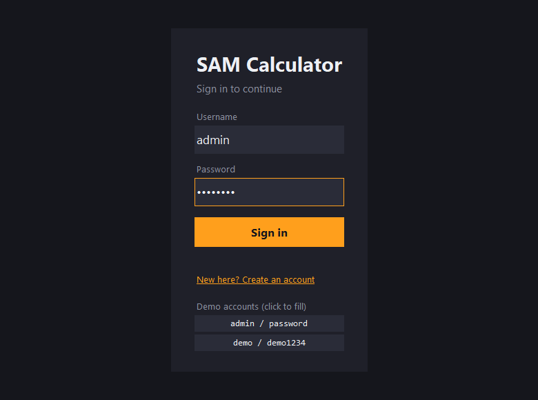
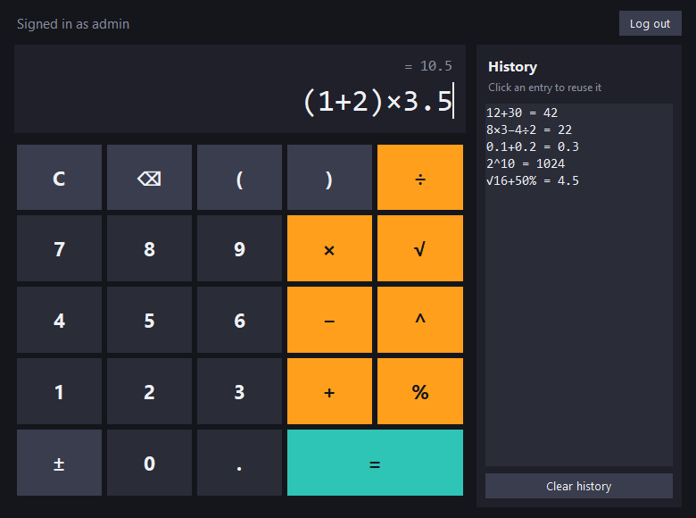

# sam0002: SAM Calculator

A desktop calculator application in Python. It opens a window with a sign-in screen, a calculator keypad, a live
result preview and a history list. It also runs in a terminal or in Google Colab.

| Sign in | Calculator |
|---|---|
|  |  |

## Features

- **Calculations:** `+ − × ÷`, powers `^`, percent `%` (`50%` = 0.5, `200×10%` = 20), square root `√`, brackets,
  negative numbers, implicit multiplication like `2(3+4)`, and scientific notation like `1.5e-3`.
- **Exact decimals:** `0.1+0.2` gives `0.3`, not `0.30000000000000004`. Answers show 15 significant digits, and
  results like `(1+0.05/365)^(365*10)` (daily compound interest) are exact to all of them.
- **Safe:** it never runs the text you type as Python code (no `eval`). Errors such as dividing by zero, a missing
  bracket, a number that's too large or too many nested brackets get a clear message instead of a crash.
- **Keypad or keyboard:** you can type directly. <kbd>Enter</kbd> calculates and <kbd>Esc</kbd> clears. `±` flips
  the sign, and `⌫` deletes one character.
- **Keep calculating from an answer:** type an operator after a result to carry on. The full-precision value is
  used, so `1÷3` then `×3` gives exactly `1`, and `-3` then `^2` gives `9`.
- **Live preview:** the answer appears while you type.
- **History:** every result is listed, and clicking an entry puts it back in the calculator. It is cleared when you
  log out.
- **Sign-in:**
  - Real accounts are stored as salted PBKDF2-SHA256 hashes in a local file, never as plain text.
  - After 5 wrong passwords, that account is locked for 30 seconds. The lock is saved, so restarting the app doesn't
    skip it.
  - **Demo mode** (on by default) fills in `admin` / `password` (the original app's login) so the app can be shown
    quickly. The `demo` / `demo1234` account can be clicked on the login screen.
  - For real use, start the app with `--no-demo`. The demo accounts are then hidden and refused, and logging out
    leaves no username or password in the form.
- **No installs needed:** it uses only the Python standard library, including Tkinter for the window.

## Run it

**Windows:** double-click `run_calculator.bat`, or:

```bash
python -m sam_calculator              # desktop window
python -m sam_calculator --cli        # in the terminal
python -m sam_calculator --no-demo    # real accounts only; the first run asks you to create one
```

Accounts are saved in `%APPDATA%\sam0002\accounts.json` on Windows and `~/.config/sam0002/accounts.json` on
Mac/Linux. To use another folder, pass `--data-dir DIR` or set `SAM0002_HOME`.

To install it as a command: `pip install .`, then run `sam-calculator`.

**Google Colab:** Colab has no desktop window, so use the console mode:

```python
!git clone https://github.com/Sampathraj1203/sam0002.git
%cd sam0002
from sam_calculator import cli
from sam_calculator.auth import AccountStore
cli.run(AccountStore())
```

At the `Username [admin]:` prompt, press Enter to use the demo account. Then type calculations such as `12+30` or
`2^10`, and type `quit` to stop.

**In your own code:**

```python
from sam_calculator import calculate
calculate("(1+2)*3.5")   # '10.5'
```

## Project layout

```
sam_calculator/
  engine.py     safe expression parser and calculator (Decimal arithmetic)
  auth.py       accounts, hashed passwords, demo accounts, lockout
  gui.py        Tkinter desktop window
  cli.py        console version
  __main__.py   python -m sam_calculator
tests/          unit tests for the engine, accounts, console and window
untitled28.ipynb  the original 2023 Colab notebook
```

## Tests

```bash
python -m unittest discover -s tests -v
```

The window tests are skipped automatically where no display is available, such as in Colab.

## History

- **v1 (2023):** `untitled28.ipynb` is a Colab notebook. It checked a username and password written in the code,
  then added two numbers.
- **v2 (2026):** a full calculator, a desktop window, hashed accounts, a console mode and tests.

MIT License © 2023 sampathraj B M
